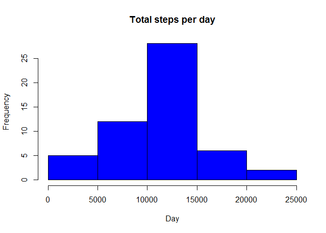
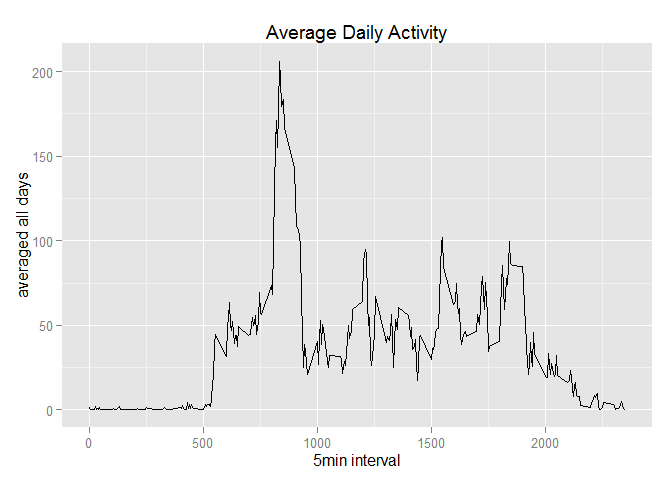
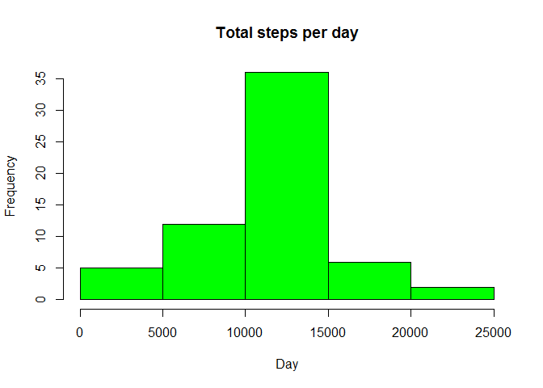

#Peer Assesment 1

##Loading and preprocessing the data

First unzip and load the data


```r
'?knit2html'
```

```
## [1] "?knit2html"
```

```r
unzip("repdata-data-activity.zip")
data <- read.csv("activity.csv", header = TRUE,  na.strings = "NA", sep = "," , stringsAsFactors = FALSE)
```

Now, check the summary to get a sense of the data


```r
summary(data)
```

```
##      steps            date              interval     
##  Min.   :  0.00   Length:17568       Min.   :   0.0  
##  1st Qu.:  0.00   Class :character   1st Qu.: 588.8  
##  Median :  0.00   Mode  :character   Median :1177.5  
##  Mean   : 37.38                      Mean   :1177.5  
##  3rd Qu.: 12.00                      3rd Qu.:1766.2  
##  Max.   :806.00                      Max.   :2355.0  
##  NA's   :2304
```

There are many NA's , lets see how the data looks


## What is mean total number of steps taken per day?

For this part we are ignoring the NA's and i am omitting the NA's form the data set and creating a new dataframe


```r
dataNoNA <- na.omit(data)
```

Running summary to check if i have ommited all the NA's or not


```r
summary(dataNoNA)
```

```
##      steps            date              interval     
##  Min.   :  0.00   Length:15264       Min.   :   0.0  
##  1st Qu.:  0.00   Class :character   1st Qu.: 588.8  
##  Median :  0.00   Mode  :character   Median :1177.5  
##  Mean   : 37.38                      Mean   :1177.5  
##  3rd Qu.: 12.00                      3rd Qu.:1766.2  
##  Max.   :806.00                      Max.   :2355.0
```

Using data.table to subset the data and checking how the data looks


```r
library(data.table)
dataTable <- data.table(dataNoNA)
dataTotalSteps <- dataTable[,.(totalSteps=sum(steps),mean=mean(steps), median=median(steps)), by = date]
head(dataTotalSteps)
```

```
##          date totalSteps     mean median
## 1: 2012-10-02        126  0.43750      0
## 2: 2012-10-03      11352 39.41667      0
## 3: 2012-10-04      12116 42.06944      0
## 4: 2012-10-05      13294 46.15972      0
## 5: 2012-10-06      15420 53.54167      0
## 6: 2012-10-07      11015 38.24653      0
```

Checking for the mean,median of the data by calling summary


```r
summary(dataTotalSteps)
```

```
##      date             totalSteps         mean             median 
##  Length:53          Min.   :   41   Min.   : 0.1424   Min.   :0  
##  Class :character   1st Qu.: 8841   1st Qu.:30.6979   1st Qu.:0  
##  Mode  :character   Median :10765   Median :37.3785   Median :0  
##                     Mean   :10766   Mean   :37.3826   Mean   :0  
##                     3rd Qu.:13294   3rd Qu.:46.1597   3rd Qu.:0  
##                     Max.   :21194   Max.   :73.5903   Max.   :0
```

Plotting Histogram for the total number of steps taken each day


```r
hist(dataTotalSteps$totalSteps, main = "Total steps per day", xlab= "Day", col = "blue")
```

 

## What is the average daily activity pattern?

For this question, I am still using the data with omitted NA's and converting interval 


Now, subsettign the data with the average of steps by the interval with data.table


```r
dataInterval <- as.data.table(na.omit(data))
dataAverageInterval <- dataInterval[,.(averageSteps=mean(steps)), by = interval]
```


plotting a time series plot  of the 5-minute interval (x-axis) and the average number of steps taken, averaged across all days (y-axis)


```r
library(ggplot2)
ggplot( data = dataAverageInterval, aes( interval, averageSteps)) + geom_line() + xlab("5min interval") +
  ylab("averaged all days") +
  ggtitle("Average Daily Activity")
```

 


Calculating the 5 min interval that has maximum number of steps


```r
dataAverageInterval<- dataAverageInterval[,.SD[order(-averageSteps)]]
head(dataAverageInterval)
```

```
##    interval averageSteps
## 1:      835     206.1698
## 2:      840     195.9245
## 3:      850     183.3962
## 4:      845     179.5660
## 5:      830     177.3019
## 6:      820     171.1509
```

The maximum number of steps are in the 835 (5min) interval.

##Imputing missing values

In this next part of analysis, first calculating and checking the no. of missing rows.


```r
summary(data)
```

```
##      steps            date              interval     
##  Min.   :  0.00   Length:17568       Min.   :   0.0  
##  1st Qu.:  0.00   Class :character   1st Qu.: 588.8  
##  Median :  0.00   Mode  :character   Median :1177.5  
##  Mean   : 37.38                      Mean   :1177.5  
##  3rd Qu.: 12.00                      3rd Qu.:1766.2  
##  Max.   :806.00                      Max.   :2355.0  
##  NA's   :2304
```

summary shows 2304  NA's in the data.
Lets find out the percentage of the missing values in the data


```r
mean(is.na(data))
```

```
## [1] 0.04371585
```
Missing values are 4.3% which is relatively low.
Lets check one more way to seee the no. of rows with NA's

```r
nrow(data[!complete.cases(data),])
```

```
## [1] 2304
```

it's the same 2304 rows as shown in the summary.
Now replace the NA's with the mean number of steps on that day


```r
StepsAverage <- aggregate(steps ~ interval, data = data, FUN = mean)
fillNA <- numeric()
for (i in 1:nrow(data)) {
        df <- data[i, ]
        if (is.na(df$steps)) {
                steps <- subset(StepsAverage, interval == df$interval)$steps
        } else {
                steps <- df$steps
        }
        fillNA <- c(fillNA, steps)
}
```

Created a new data frame after filling the NA's with the mean of the interval and check 
if the NA's are replaced.
Also make a dataframe with total number of steps per day and plot a histogram with total number of steps per day after imputing the data


```r
new_data <- data
new_data$steps <- fillNA
sum(is.na(new_data))
```

```
## [1] 0
```

```r
StepsTotal <- aggregate(steps ~ date, data = new_data, sum)
```


But need to see how much these NA's effect the analysis.
Making a histogram with total number of steps per day after imputing the data


```r
hist(StepsTotal$steps, main = "Total steps per day", xlab= "Day", col = "green")
```

 

Checking summary to see weather the mean and median has changed
This is imputed NA dataframe


```r
summary(StepsTotal)
```

```
##      date               steps      
##  Length:61          Min.   :   41  
##  Class :character   1st Qu.: 9819  
##  Mode  :character   Median :10766  
##                     Mean   :10766  
##                     3rd Qu.:12811  
##                     Max.   :21194
```

This is old dataframe with omitted NA's


```r
summary(dataTotalSteps)
```

```
##      date             totalSteps         mean             median 
##  Length:53          Min.   :   41   Min.   : 0.1424   Min.   :0  
##  Class :character   1st Qu.: 8841   1st Qu.:30.6979   1st Qu.:0  
##  Mode  :character   Median :10765   Median :37.3785   Median :0  
##                     Mean   :10766   Mean   :37.3826   Mean   :0  
##                     3rd Qu.:13294   3rd Qu.:46.1597   3rd Qu.:0  
##                     Max.   :21194   Max.   :73.5903   Max.   :0
```
The mean is still the same but the median is slightly changed.
There seems to be no major impact on the analysis after imputing the missing data.

##Are there differences in activity patterns between weekdays and weekends?

for this part, using weekday() function for changing date to weekday and weekend.
check how the data looks after subsetting


```r
new_data$date <- as.Date(new_data$date)

day <- weekdays(new_data$date)
daylevel <- vector()
for (i in 1:nrow(new_data)) {
    if (day[i] == "Saturday") {
        daylevel[i] <- "Weekend"
    } else if (day[i] == "Sunday") {
        daylevel[i] <- "Weekend"
    } else {
        daylevel[i] <- "Weekday"
    }
}
new_data$daylevel <- daylevel
new_data$daylevel <- factor(new_data$daylevel)

stepsByDay <- aggregate(steps ~ interval + daylevel, data = new_data, mean)
names(stepsByDay) <- c("interval", "daylevel", "steps")
```

plotting time series with the average number of steps for weekday and weekend


```r
library(lattice)
xyplot(steps ~ interval | daylevel, stepsByDay, type = "l", layout = c(1, 2), 
    xlab = "Interval", ylab = "Number of steps")
```

 


There seems to have some difference in the activity of the person on weekdays and weekends, weekends are active than weekdays.


